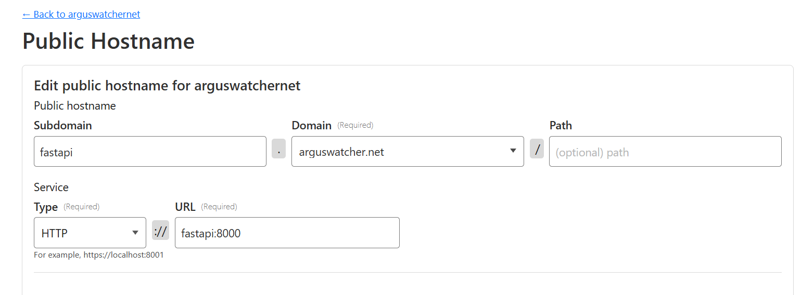
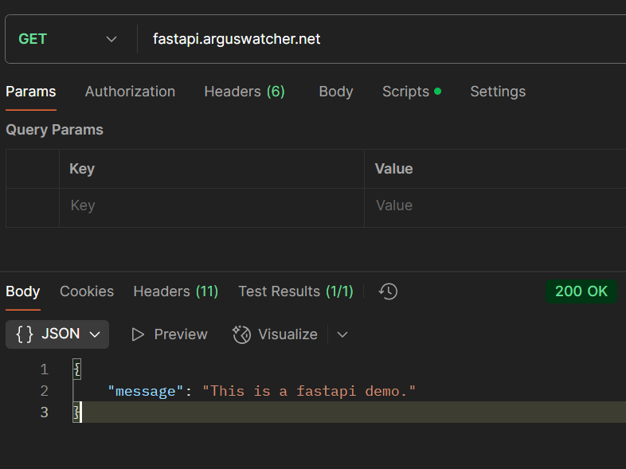

# FastAPI Module: Dockerize FastAPI and Cloudflare

[Back](../README.md)

- [FastAPI Module: Dockerize FastAPI and Cloudflare](#fastapi-module-dockerize-fastapi-and-cloudflare)
  - [Create a Demo API](#create-a-demo-api)
  - [Dockerize FastAPI](#dockerize-fastapi)
  - [Integrate with Cloudflare](#integrate-with-cloudflare)
  - [Cloudflare Tunnel Configuration](#cloudflare-tunnel-configuration)

---

## Create a Demo API

- Create environment

```sh
python -m venv env

# activate
env\Scripts\activate

# install fastapi package
python -m pip install --upgrade pip
pip install "fastapi[standard]"
```

- Create Demo App

- `app/main.py`

```py
from fastapi import FastAPI

app= FastAPI(title="Demo")

@app.get("/")
async def root():
    return {"message": "this is a FastAPI demo."}
```

- Run local test

```sh
fastapi dev main.py
uvicorn app.main:app --host 127.0.0.1 --port 8000
```

- Collect dependencies

```sh
pip freeze > app\requirements.txt
```

---

## Dockerize FastAPI

```Dockfile
FROM python:3.11

WORKDIR /app
COPY ./app .
RUN pip install --no-cache-dir --upgrade -r /app/requirements.txt
CMD ["uvicorn", "main:app", "--host", "0.0.0.0", "--port", "8000"]
```

- Build image and run

```sh
docker build -t fastapi-demo .
docker images fastapi-demo

docker run --name fastapi-demo-container -p 8000:8000 fastapi-demo
# localhost:8000
```

---

## Integrate with Cloudflare

- ref:
  - docker run cloudflare/cloudflared:latest tunnel --no-autoupdate run --token XXXXXXXX

```yaml
services:
  fastapi:
    container_name: fastapi
    build:
      context: .
      dockerfile: Dockerfile
    restart: unless-stopped
    ports:
      - "8000:8000" # Optional: Expose locally for testing
    networks:
      - app-network

  cloudflare-tunnel:
    container_name: cloudflare-tunnel
    image: cloudflare/cloudflared:latest
    restart: unless-stopped
    command: tunnel --no-autoupdate run --token ${TUNNEL_TOKEN}
    environment:
      - "TUNNEL_TOKEN=${TUNNEL_TOKEN}"
    depends_on:
      - fastapi
    networks:
      - app-network

networks:
  app-network:
    driver: bridge
```

---

## Cloudflare Tunnel Configuration

- Service:
  - Type: HTTP
  - URL: fastapi:8000
    - service name + port number



- Test:


